## Getting Access to CRC Shared Drive on KoaCloud
**READ BEFORE MOVING ON** 
If this is your first time using Koa Cloud, you will need to get your UH account setup with KoaCloud.
1. Go to https://koacloud.its.hawaii.edu

2. Log in with your UH Username and Password
3. Email skyler8@hawaii.edu or mbarbee@hawaii.edu to that you setup your account on KoaCloud, so they can grant access to CRC shared drive

There are two ways to access and use KoaCloud:
- web interface
- sync client

## Web Interface

* Going to https://koacloud.its.hawaii.edu/ will direct you to the web interface
* You can manage files and upload new files to KoaCloud through this interface
* There are other features that the web interface provides

## Sync Client (Mountable Drive)
UH ITS made a guide on how to install the sync client over [here](https://uhawaii.atlassian.net/wiki/spaces/RStorage/pages/452460690/Sync+Client)  

For CRC's KoaCloud directory, there are specific configurations that we recommend

### Syncing with user directory 

- When it comes to configuring your folder sync option, **DO NOT SELECT THE FIRST OPTION** (Synchronize everything from server) 
- Please select the second option, where you get to choose what to sync.
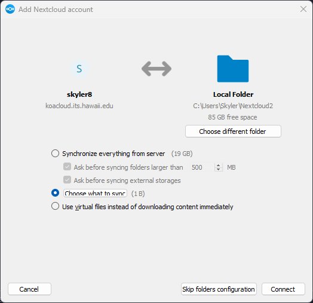

- In the "Users" directory, you will find a directory named with your UH username. Please select only that folder to sync. 
- If you cannot find a directory with your UH username, please email skyler8@hawaii.edu or mbarbee@hawaii.edu. 
- Once you have selected **only** the directory named with your UH username, click "OK". 

- After choosing your user directory, the folder configuration window will show the amount of space your user directory will take up.
- The amount of free space in your Local Folder is shown as well
- This syncing method will download everything in your CRC KoaCloud user directory into your Local Folder.
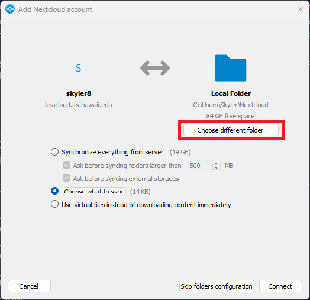

- You may want to change the "Local Folder" to be on a different hard drive and/or you may want change the name of the "Local Folder"
- Click on "Choose different folder"

- In the directory dialog, select a folder on your computer that has sufficient space. Choosing a folder within an external hard drive is recommeneded.
- You can also name the folder anything you want as long as you can remember what it holds.
- After choosing/naming the folder that will hold your KoaCloud user directory, click "Select Folder"

- Once your folder configuration looks good, you can click "Connect"
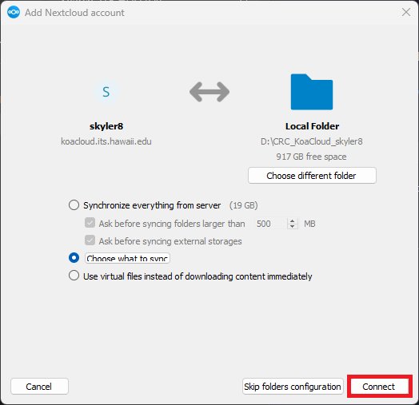

Now you are done syncing with your CRC KoaCloud user directory, you will have to access the other CRC directories with a different method 
Since the other CRC directories will have **well over 100 GB** of files, you do not want to download a copy of everything (which is what the above method does). 

You can either:
- Access the files in the web interface (similar to using Google Drives web interface)
- You can also locally mount the directory with virtual files
    - Virtual files are copies of the file that represent what is inside KoaCloud, but do not take up any space (similar to Google Drives desktop application)

### Sync with other CRC KoaCloud directory (virtual files)
- Open NextCloud sync client window
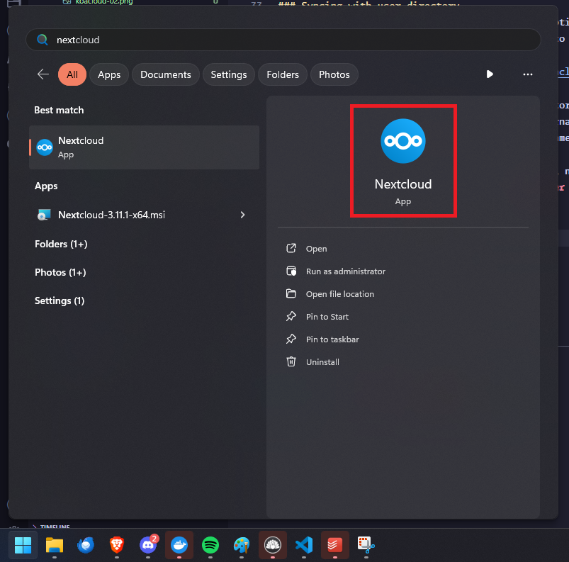
- Click on your username on the NextCloud Window
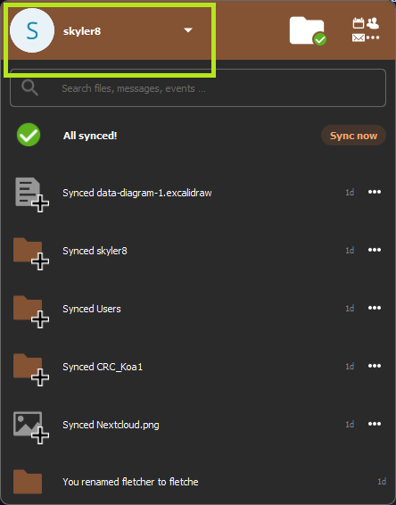
- Click on "Settings" in the dropdown menu
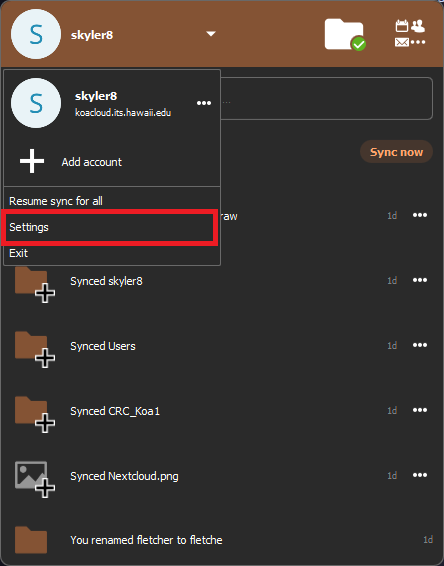
- Click on "Add Folder Sync Connection"
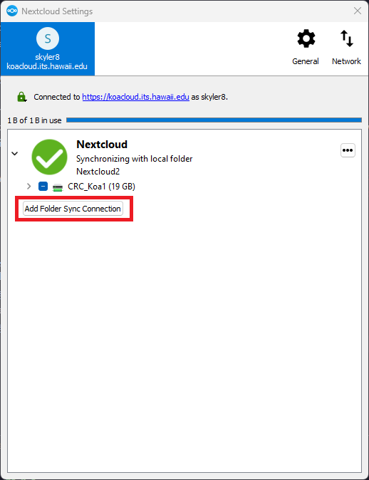
- Enter the path on your local machine that you would like to access this "virtual" directory and then click "Next"
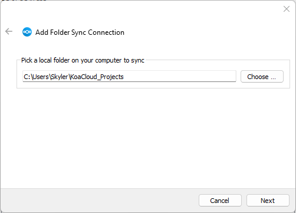
- Select the folder on KoaCloud that you would like to sync virtually
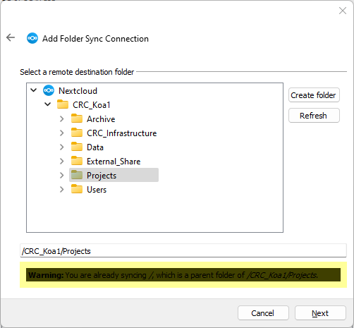
- Be sure to check the "Use virtual files instead of downloading content immediately" checkbox
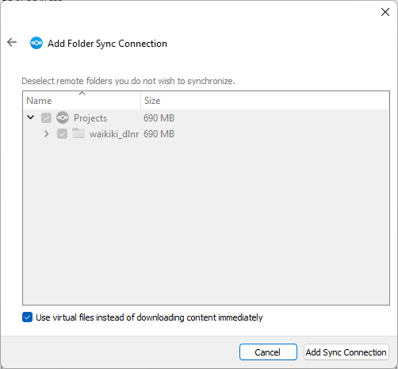
- To complete connection click "Add Sync Connection"
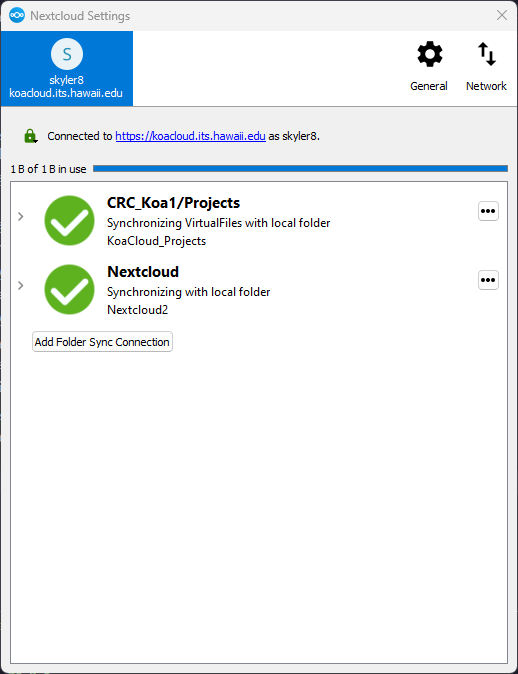

