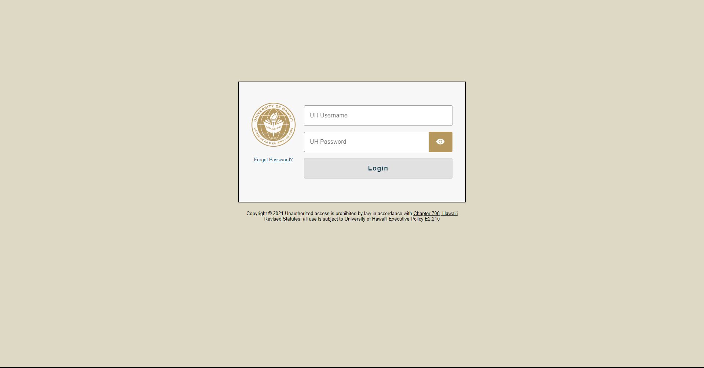
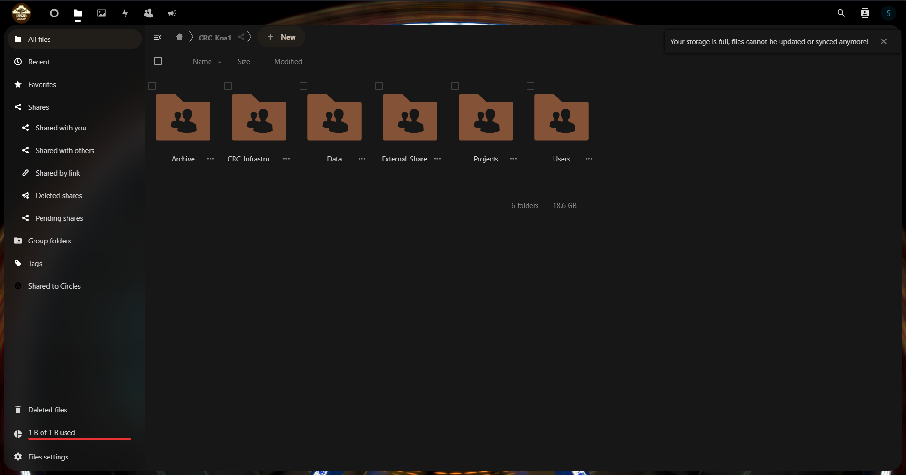

## Getting Access to CRC Shared Drive on KoaCloud
**READ BEFORE MOVING ON** 
If this is your first time using Koa Cloud, you will need to get your UH account setup with KoaCloud.
1. Go to https://koacloud.its.hawaii.edu

2. Log in with your UH Username and Password
3. Email skyler8@hawaii.edu or mbarbee@hawaii.edu to that you setup your account on KoaCloud, so they can grant access to CRC shared drive

There are two ways to access and use KoaCloud:
- web interface
- sync client

## [Web Interface](https://koacloud.its.hawaii.edu/)

* Going to https://koacloud.its.hawaii.edu/ will direct you to the web interface
* You can manage files and upload new files to KoaCloud through this interface
* There are other features that the web interface provides

## Sync Client (Mountable Drive)
UH ITS made a guide on how to install the sync client over [here](https://uhawaii.atlassian.net/wiki/spaces/RStorage/pages/452460690/Sync+Client)  

Specifically for CRC's KoaCloud directory, there are specific configurations that we recommend:
[KoaCloud Client Configuration](../../../../../assets/koacloud/koacloud-05.png)

### Syncing with user directory
When it comes to configuring your folder sync option, **DO NOT SELECT THE FIRST OPTION** 
Please select the second option, where you get to choose what to sync

[KoaCloud Sync Folder](../../../../../assets/koacloud/koacloud-06.png)

In the "Users" directory, you will find a directory named with your UH username. Please select only that folder to sync. 
If you cannot find a directory with your UH username, please email skyler8@hawaii.edu or mbarbee@hawaii.edu. 
Once you have selected **only** the directory named with your UH username, click "ok" and "connect". 

After Syncing with your user directory, you will need to sync with the rest of the files virtually to other directories you need access to. 
Since the other directories will have **well over 100 GB** of files, you do not want to download a copy of everything. 

### Sync with project directory
- Open NextCloud
[Windows Open NextCloud pt 1](../../../../../assets/koacloud/koacloud-07.png)
- Click on your username on the NextCloud Window
[NextCloud Username](../../../../../assets/koacloud/koacloud-08.png)
- Click on "Settings" in the dropdown menu
[Settings Dropdown](../../../../../assets/koacloud/koacloud-09.png)
- Click on "Add Folder Sync Connection"
[Add Folder Sync Connection](../../../../../assets/koacloud/koacloud-10.png)
- Enter the path on your local machine that you would like to access this "virtual" directory and then click "Next"
[Choose path for virtual files](../../../../../assets/koacloud/koacloud-11.png)
- Select the folder on KoaCloud that you would like to sync virtually
[Choose foler that you would like to sync virutally](../../../../../assets/koacloud/koacloud-12.png)
- Be sure to check the "Use virtual files instead of downloading content immediately" checkbox
[virtual files checkbox](../../../../../assets/koacloud/koacloud-13.png)
- To complete connection click "Add Sync Connection"
[finish virtual sync](../../../../../assets/koacloud/koacloud-14.png)

