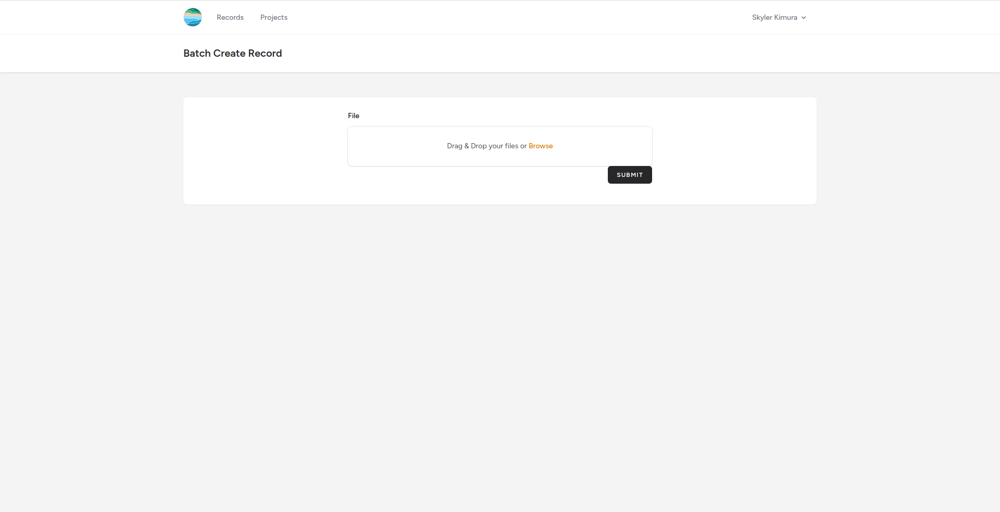
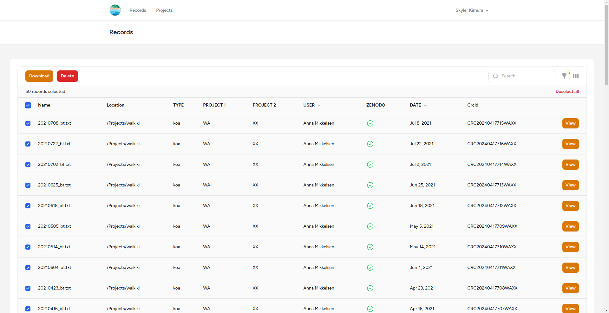

## [Go to Batch Create Record](https://crc-metadata-tool.fly.dev/records/batch)

### Create JSON to upload for Batch Record Creation
 - You can only upload JSON files 
 - There will be an example script with example json data
 - On that note, you will need to modify the script or make your own script to create a json file with all your datasets

- Drag and drop the JSON.
- Will throw errors if there are conflicts

- Click the check marks to the left of the records on the table
- Click the "Download" button at the top left 
- It will confirm if you want to download the Readme files
- Once you confirm, it will prompt you to download a zip file containing all the Readme files for the records you selected

- You can also consult Anna (abm20@hawaii.edu) since she was successfully able to do it