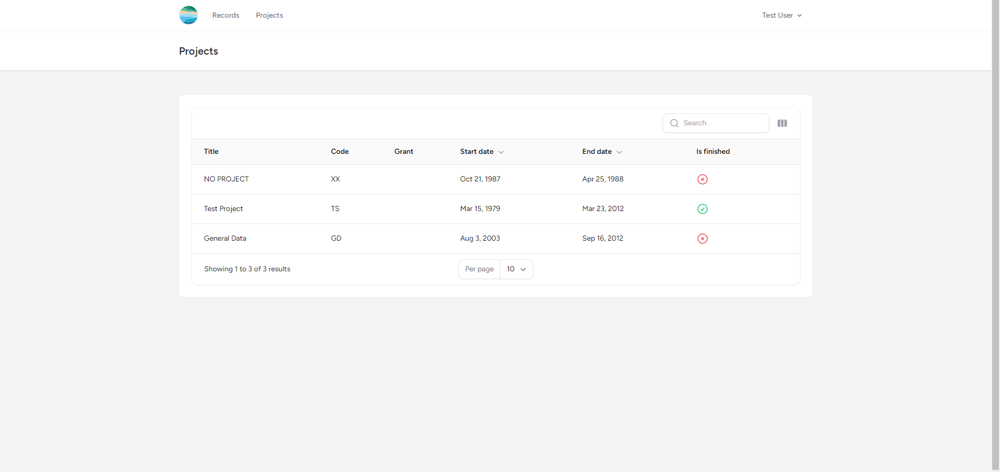
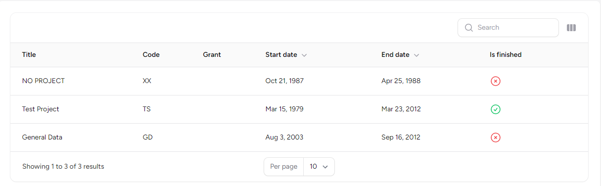
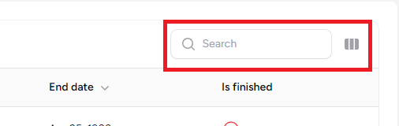
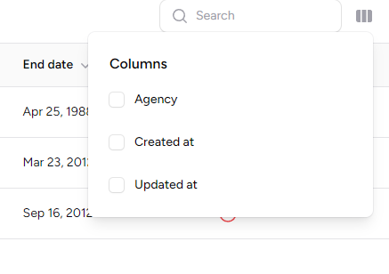

### Listing Projects

 1. Click "Projects" in the navbar or [click here](https://crc-metadata-tool.fly.dev/project)

### Project Fields

 - Project Title: Title of the project
 - Code: The project code to refrence project in CRCID
 - Grant: Grant Number for the project
 - Agency (hidden): Agency associated with the grant
 - Start Date: Start date of the project
 - End Date: End date of the project
 - Created (hidden): The date and time the project was created in the Metadata Tool
 - Updated (hidden): The date and time the project was updated in the Metadata Tool

### Searching Project

- The search bar can be used to search for projects based on following fields:
    - Project Title
    - Grant
    - Code

- Unchecked boxes are the columns that are hidden. 
- If you need to see column that is hidden, click on the box to toggle the column