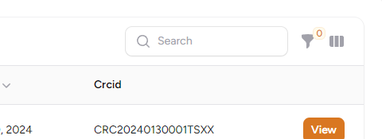
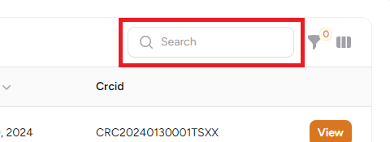
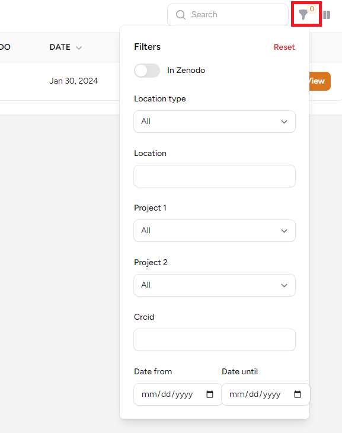
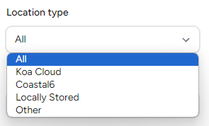
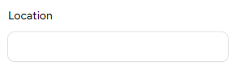
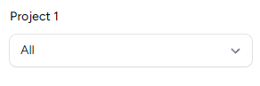
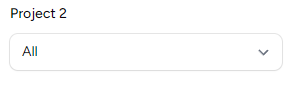
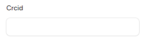
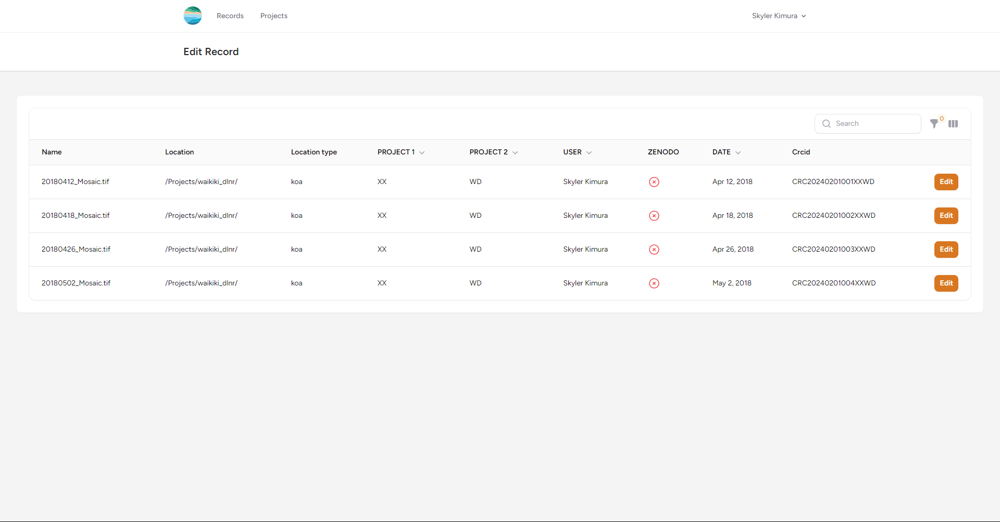
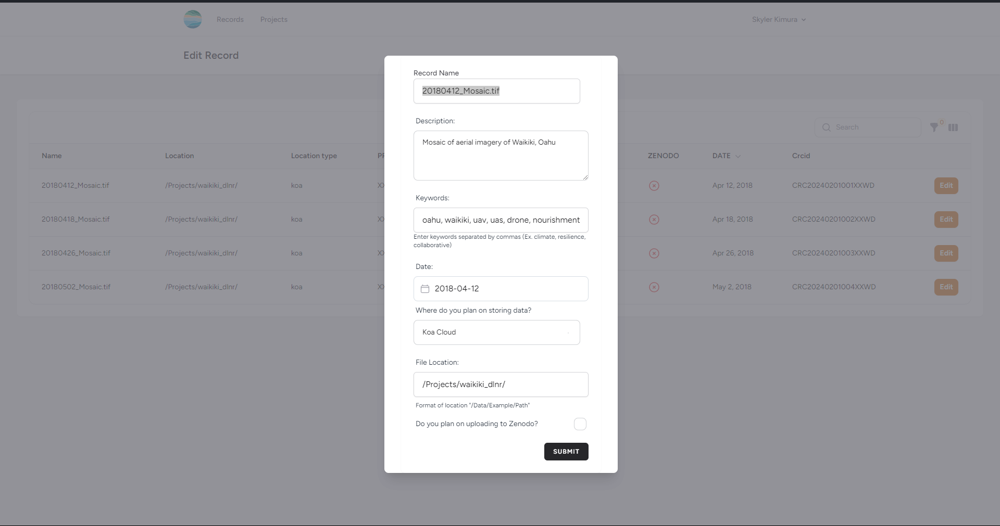

- Records are the information that represents the datasets in the Metadata Tool. There is no data or datasets stored inside the Metadata Tool, so no data will or official metadata will be modified. 
- For any further explaination on the record fields, please refer to [record curation guide](/crc-documentation/data-management/metadata-tool/guides/record-curation)

## <a href="https://https://crc-metadata-tool.fly.dev/records" target="_blank">Filtering Records</a>

- This section will go over how to search for records based on your criteria utilizing filters on the fields of the records

### Fiter based on Name of Record

- In the table searchbar, you can enter a word or partial word. The filter will display all record names that contain the exact word or partial word you entered, anywhere within the name of the record. 
- Ex. you type 'sales' it will show all datasets with names like 'sales_data,' and 'monthly_sales'. However, from the two example names,if you type 'data', only 'sales_data' will be displayed on the table.

### Filter records by specified fields

- Filter Fields
    - In Zenodo
    - Location Type
    - Location
    - Project 1
    - Project 2
    - CRCID
    - Date From - Date Until

### Filter records by storage location type

- The only four data location types are:
    - Koa
    - Coastal6
    - Locally Stored
    - Other
- See [records curation guide](/crc-documentation/data-management/metadata-tool/guides/record-curation/) for details on each data location type
- Ex. You select coastal6, then the table will display all data stored on coastal6

### Filter records by location path

### Filter records by Project 1

- Filter all records based on project 1 field even if you are not part of the project
- Select the project that the record is associated with

### Filter records by Project 2

- Filter all records based on project 2 field even if you are not part of the project
- Select the project that the record is associated with

### Filter records by CRCID 

- Reference record field description in record curation guide for more informatoin about CRCID [here](/crc-documentation/data-management/metadata-tool/guides/record-curation/)

### Filter records by record date

- Filter record based on the Date From:
    - This will show records that are dated after the specified date
- Filter record based on the Date To:
    - This will show records that are dated before the specified date

 

## Exporting Records to CSV
## TO BE IMPLEMENTED

---

## <a href="https://crc-metadata-tool.fly.dev/records/edit" target="_blank">Editing Records</a>

### How to Update Record

- Note: You can only update records from the project that you are assigned. If you do not see a record that you want to change, you are most likely not assigned the project
- If you need access to another projects records, refer back to [accessing uid tool guide](/crc-documentation/data-management/metadata-tool/guides/accessing) for instructions on how to get project assignment

### Update Record Form

For more details on the fields checkout the [data curation guide](/crc-documentation/data-management/metadata-tool/guides/record-curation) 
If needed, you can edit the fields below:
- Record Name
- Description of record
- Keywords
- Date
- Location type that the dataset is stored
- Specific file location path that the dataset is stored If the storage medium has been changed, please follow the format explained in [data curation guide](/crc-documentation/data-management/metadata-tool/guides/record-curation) for location field
- If the dataset has been moved to Zenodo, then check the Zenodo field checkbox
- Otherwise, uncheck the Zenodo field checkbox
 Most likely will not be unchecked because data should stay in Zenodo
