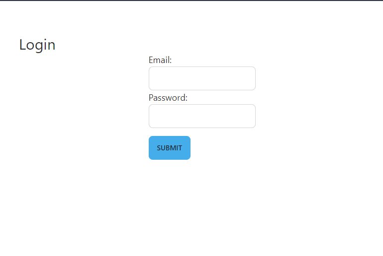

[Go to UID Tool](https://coastal5.soest.hawaii.edu/uid-tool/)

### Do you need an account?
Pages/Functionalities that require an account:
 - Curating Records
 - Updating Records
 - Projects

 One can view and filter through data without an account. The project list is also available without an account.

### Getting an Account for UID Tool
 - If you would like an account to access UID Tool, email skyler8@hawaii.edu or mbarbee@hawaii.edu
 - Users will be assigned associated projects already
 - Currently, the app doesn't utilize any email service, so no emails will be sent from the application

### Getting Project Assignment
- Users will only be able to update data from the projects that they are a part of
- To get assigned or unassigned from project, email skyler8@hawaii.edu or mbarbee@hawaii.edu