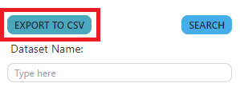
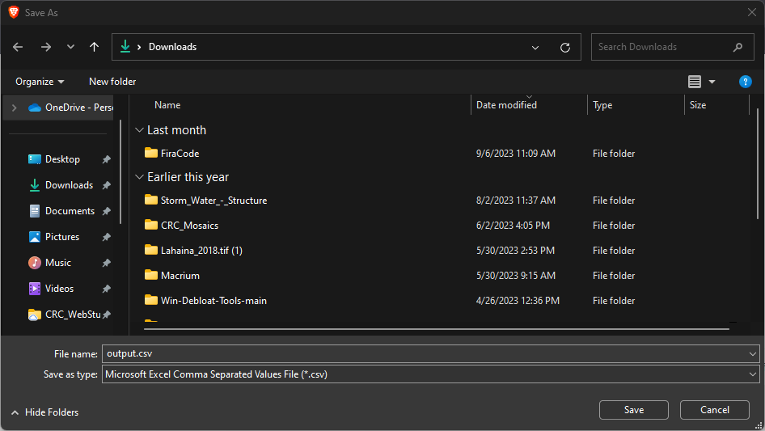

### Data Fields

 - Dataset Name: Name of the dataset
 - Created: Date and time dataset has been inputted into the UID Tool
 - Creator: Email, First and Last Name of User who curated the data
 - Location Type: The location medium type that the data has been stored
 - Invenio: Is the dataset stored in Invenio?
 - Project 1: The primary projece that the data is associated with (List of projects on project page)
 - Project 2: The secondary project that the data is associated with (List of projects on project page)
 - UID: The unique identity associated with CRC for the data
 - Description: Additional metadata for the dataset name
 - Location: The exact location that the dataset is stored
 - DOWNLOAD DATA README: Button to download a README in txt format that includes all of the information inputted into the UID tool

### Export UID Table to CSV
- Button is located at the top left data table page of the UID Tool

- Click the button to get a file directory dialog prompt to save the file on your hard drive

- Save the output.csv in your desired location
