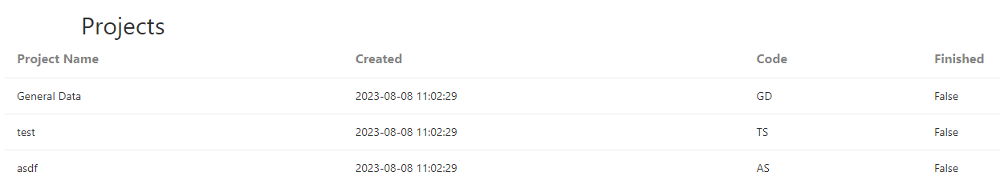

### Listing Projects

 1. Click "Projects" in the navbar or navigate to https://coastal5.soest.hawaii.edu/uid-tool/project/

### Project Fields
 - Project Name: Name of the project
 - Created: The date and time the project was created
 - Code: The project code used for data UID
 - Finished: Is the project complete (finished)?