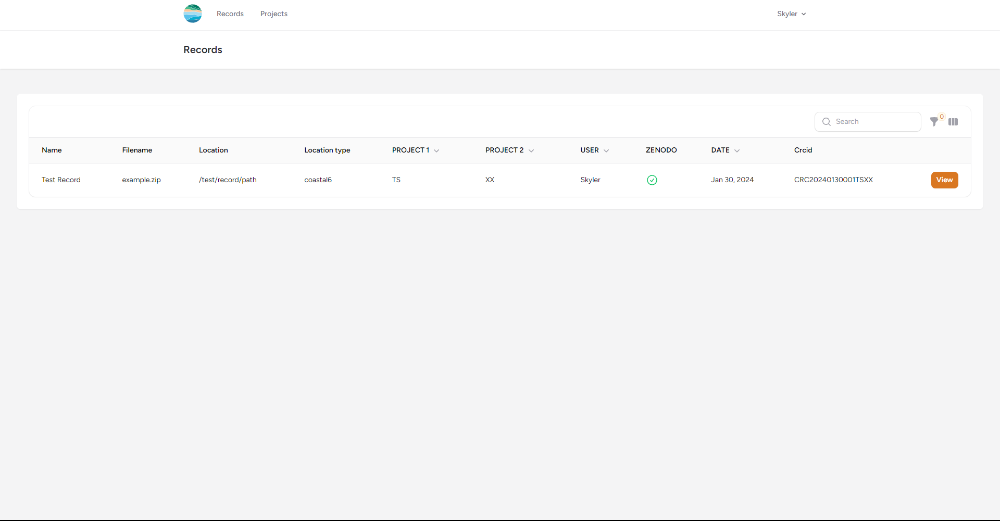
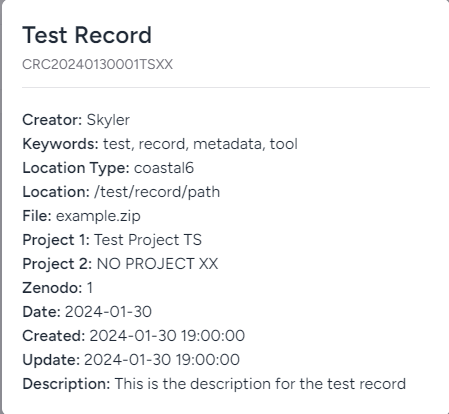
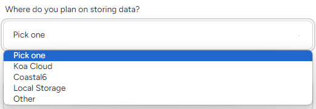

### Field Definitions

 - Record Name: Name of the record related to the dataset 
 - CRCID: The unique identity associated with CRC for the dataset
 - Creator: Name of user who curated the record
 - Keywords: Keywords that are related to the dataset
 - Location Type: The location medium type that the dataset has been stored
 - Location: The location path where the dataset file is stored
 - File: Name of the file for the dataset
 - Project 1: The primary project that the dataset is associated with (List of projects on project page)
 - Project 2: The secondary project that the dataset is associated with (List of projects on project page)
 - Zenodo: Is the data stored in Zenodo or will it be uploaded to Zenodo in the future?
 - Date: Date associated with the dataset
 - Created: Date and time record has been **curated** into the Metadata Tool
 - Updated: Date and time record has been **updated** in the Metadata Tool
 - Description: Additional metadata for the dataset name and description to further identify what the dataset means

## <a href="https://crc-metadata-tool.fly.dev/records/create" target="_blank">How to Curate Record in UID Tool?</a>

[View most recent version on Tango.us](https://app.tango.us/app/workflow/e2aed1bc-5fb3-4842-8746-1fa30482f3e8?utm_source=markdown&utm_medium=markdown&utm_campaign=workflow%20export%20links)

### 1. In the navigation bar, click on Records

### 2. In the dropdown, click on Create Record

### 3. Type in name that is associated with the dataset

### 4. Type a description of the dataset

- The description will hold additional metadata to hold more information about the dataset. Please enter a couple of sentences about the dataset. 

### 5. Type in keywords to describe the subject/topic of the dataset

### 6. (If applicable) Select a date associated with the dataset

- If there is no explicit date that is associated with the dataset or if the date is unknown, please select the date of the record creation.

### 7. Select a Primary Project for the dataset

- The project 1 dropdown will be populated by the projects that you are assigned
- To see the list of all projects, you can view the projects [here](/crc-documentation/data-management/uid-tool/guides/projects/)
- If you need to access to another project, please email skyler8@hawaii.edu or mbarbee@hawaii.edu
- Dataset needs to have at least one associated project. If there's not a specific project associated to the dataset, choose General Data.

### 8. Select a Secondary Project for dataset

- The project 2 dropdown will be also populated by the projects that you are assigned
- Please be sure to select a different project from project 1, or this field will default to a blank "N/A" project
- Data may be associated to two project. If not, please leave project 2 as the first option "Pick one" this will default to a blank "N/A" project

### 9. Select a Location Type (Preferably KoaCloud)

Note: This field is only a note for the location of your dataset that will be stored in a database. It is preferrable to store data on KoaCloud and keep any copy or backup in local storage and/or coastal6 (More backups the better)
- KoaCloud
    - Storing data 
- Coastal6
    - Storing datasets on coastal6 network drive is a good temporary storage medium for sharing big files. Storing datasets in CRC network drive, coastal6, requires user to be connected to the SOEST network. 
- Locally Stored
    - Locally storing datasets includes storing on computer hard drive, external hard drive, or USB drive. Anything that doesn't require network access.
- Other
    - Other storage methods includes, but not limited to Google Drive, FTP, imina, and koa long term storage.
    - Any online storage

### 10. Type in the location path for the dataset

- For each storage medium, type in the **FULL** location of the dataset in a readable format. Below are examples of the format depending on the storage medium
- Coastal6/KoaCloud
    - Format: /Data/example/
- Other/Local Storage
    - Format: Device-Name:/path-name/
        - skyler-laptop:/home/skyler/
        - Google-Drive:/Data/Example/
        - koa:/Shared-Storage/skyler/
        - imina.soest.hawaii.edu:/htdocs/
- Note: Type out explicitly the device name to fully describe where the dataset is stored. This information will help you and other identify where the datasets are stored.

### 11. Type in the file name

- **IMPORTANT** To ensure efficient organization of your dataset, it is essential to compress multiple files associated with a single dataset before uploading. Please use common compression formats like .zip or .tar.gz (tarball).
    - Exmample: Compressing files associated with a Shapefile
    - Compress shapefile with auxilary and metadata files needed to read/access the shapefile (CPG, DBF, PRJ, LOCK, SHX)
- You do not need to compress a dataset if it is only a single file

### 12. Check Do you plan on uploading to Zenodo?

- Check yes if...
    - The dataset is already published on Zenodo
    - You plan on publishing on to Zenodo
- Don't check yes if...
    - The dataset will not be published on Zenodo

### 13. Click on SUBMIT

- When information in the form is ready to be submitted, click the submit button. 
- Make sure all of the fields are filled out with information. Otherwise, you will not be able to submit the form
- Red text will appear underneath the field if there are any issues with the inputs after submitting
- Contact skyler8@hawaii.edu if you have any questions

 

***
Created with [Tango.us](https://tango.us?utm_source=markdown&utm_medium=markdown&utm_campaign=workflow%20export%20links)
 