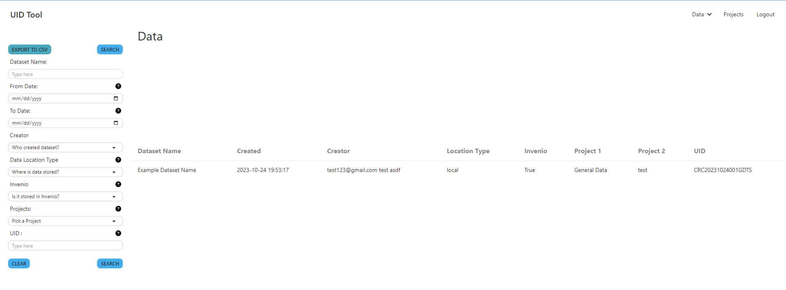
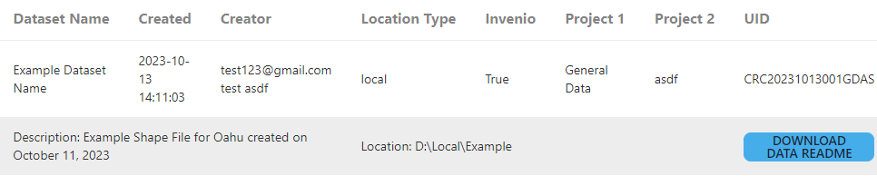
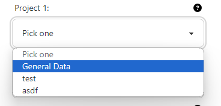
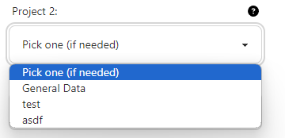
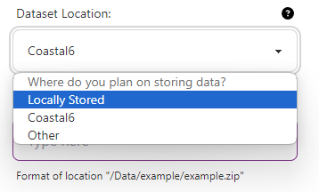
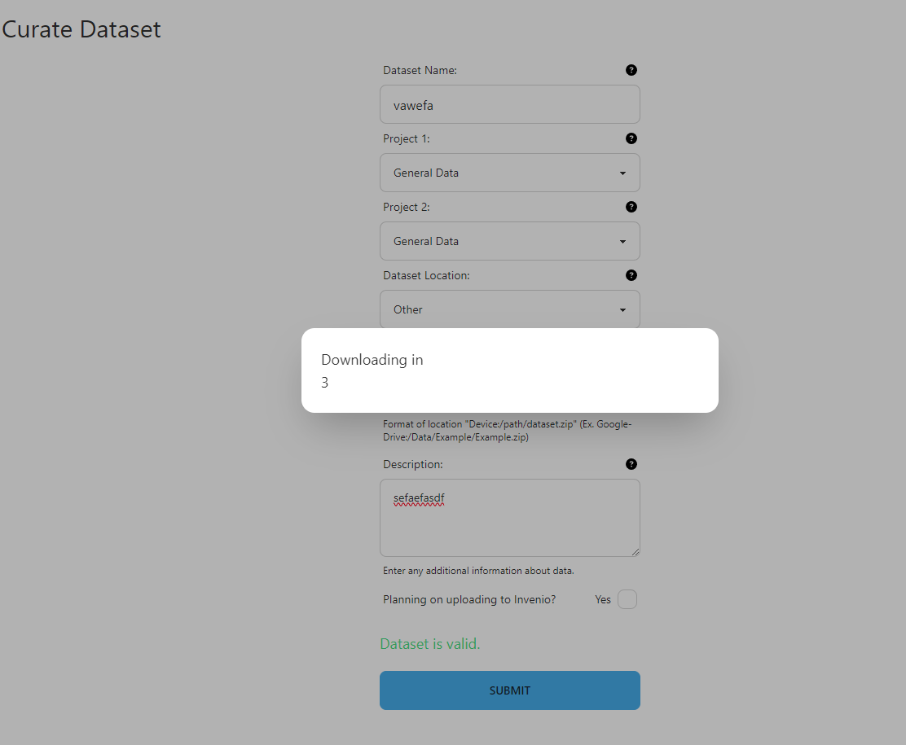
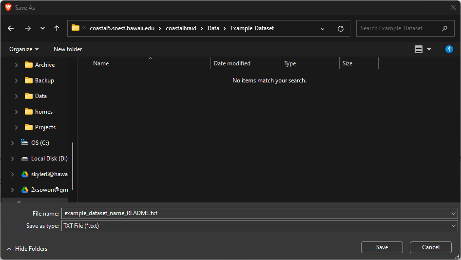
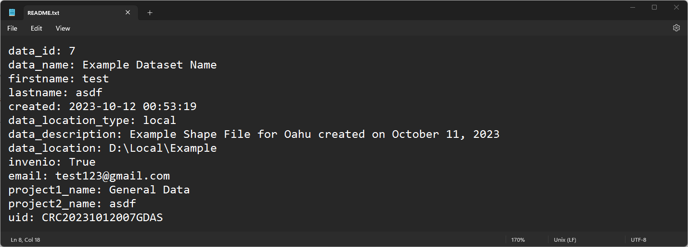

### Field Definitions

 - Dataset Name: Name of the dataset
 - Created: Date and time dataset has been inputted into the UID Tool
 - Creator: Email, First and Last Name of User who curated the data
 - Location Type: The location medium type that the data has been stored
 - Invenio: Is the dataset stored in Invenio?
 - Project 1: The primary projece that the data is associated with (List of projects on project page)
 - Project 2: The secondary project that the data is associated with (List of projects on project page)
 - UID: The unique identity associated with CRC for the data
 - Description: Additional metadata for the dataset name
 - Location: The exact location that the dataset is stored
 - DOWNLOAD DATA README: Button to download a README in txt format that includes all of the information inputted into the UID tool

## <a href="https://coastal5.soest.hawaii.edu/uid-tool/data/create" target="_blank">How to Curate Record in UID Tool?</a>

### 1. Type in name that is associated to the dataset

### 2. Select a project from Project 1

- The dropdown will be populated by the projects that you are assigned
- To see the list of all projects, you can view the projects [here](/crc-documentation/data-management/uid-tool/guides/projects/)
- If you need to access to another project, please email skyler8@hawaii.edu or mbarbee@hawaii.edu
- Dataset needs to have at least one associated project. If there's not a specific project associated to the dataset, choose General Data.

### 3. (If needed) Select project from Project 2

- The project 2 dropdown will be also populated by the projects that you are assigned
- Please be sure to select a different project, or this field will default to a blank "N/A" project
- Data may be associated to two project. If not, please leave project 2 as the first option "Pick one (if needed)" this will default to a blank "N/A" project

### 4. Choose where you plan on storing data

Note: This field is only a note for the location of your dataset that will be stored in a database. It is preferrable to store data on coastal6 and keep any copy or backup in local storage
- Locally Stored
    - Locally storing dataset includes storing on computer hard drive, external hard drive, or USB drive. Anything that doesn't require network access.
- Coastal6 (soon to be KoaCloud)
    - Storing dataset on coastal6 network drive is the prefered storage medium. Storing datasets in CRC network drive, coastal6, requires user to be connected to the SOEST network. 
- Other
    - Other storage methods includes, but not limited to Google Drive, FTP, imina, and koa long term storage.

### 5. Type in the location of the dataset

- For each storage medium, type in the **FULL** location of the dataset in a readable format. There are examples of the format depending on the storage medium
- Locally Stored
    - Format: D:\Local\Stored
- Coastal6
    - Format: /Data/example/example.zip
- Other
    - Format: Device:/path/dataset.zip 
        - Google-Drive:/Data/Example/Example.zip
        - koa:/Shared-Storage/skyler/vector_db.zip
        - imina.soest.hawaii.edu:/htdocs/index.html

### 6. Type description of the dataset

- The description will additional metadata. Please enter include type of file, geolocation that represents the dataset, and the relavent date (MM/DD/YYYY) associated to the dataset if applicable.

### 7. Check/Uncheck checkmark next to "Planning on publishing to Zenodo"?…

- Check yes if...
    - The data is already published on Zenodo
    - You plan on publishing on to Zenodo
- Don't check yes if...
    - The data will not be published on Zenodo

### 8. Click on Submit Button

- When information in the form is ready to be submitted, click the submit button. 
- Above the submit button, there will be text that will validate if the record can be submitted
- If record cannot be created, red text with an error will display and the submit button will be disabled until the form error is fixed
- If record can be created, green text will dislay and the submit button will be clickable

### 9. Download README will start

- After submitting the data curation form, a download counter will start

- A dialog asking to save your data will pop up
- Store the README.txt as {name of dataset}_README.txt in the same location as your dataset for documentation purposes
- Ex. example_dataset_README.txt

- The README.txt file will hold the information that you just submitted

 