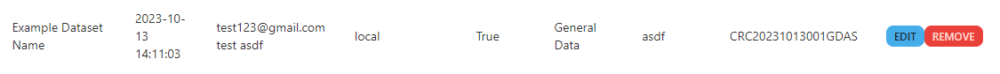
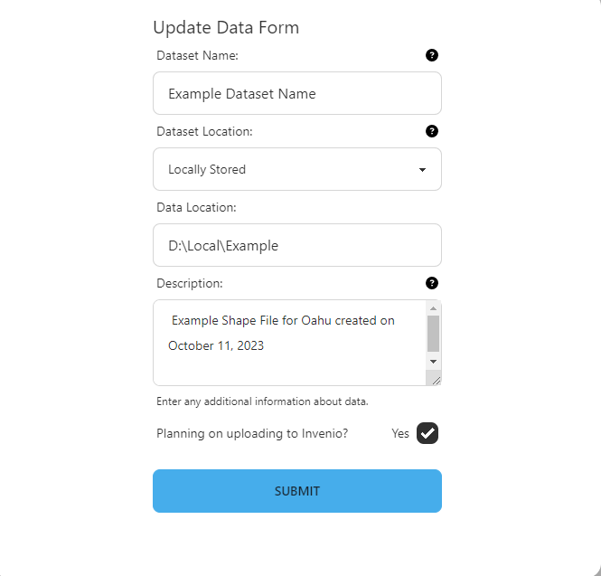

### How to Update Data

- Note: You can only update data from the project that you are a part of

### Dataset Form

For more details on the fields checkout the [data curation guide](/data-management/uid-tool/guides/updating-data) 
If needed, you can edit the fields below:
- Dataset name
- Storage medium type that the dataset is stored in
- Specific location that the dataset is stored If the storage medium has been changed, please follow the format explained in [data curation guide](/data-management/uid-tool/guides/updating-data) for location field
- Description of the dataset
- If the dataset has been moved to Invenio Most likely will not be unchecked because data should stay in Invenio