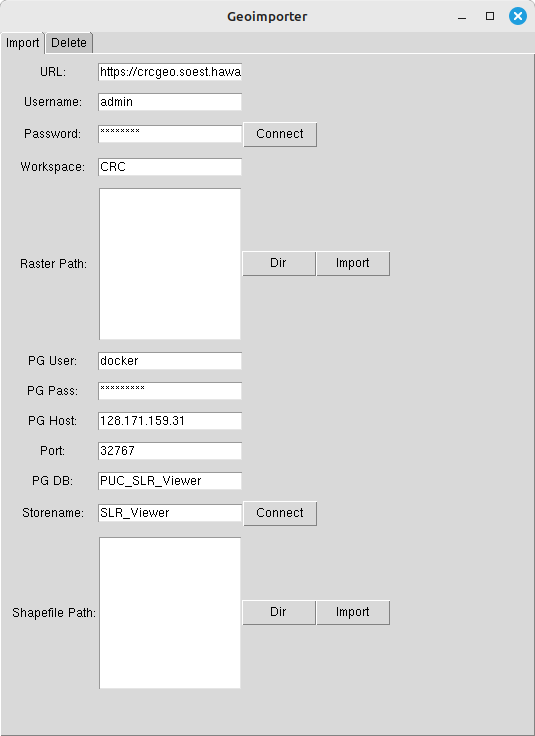
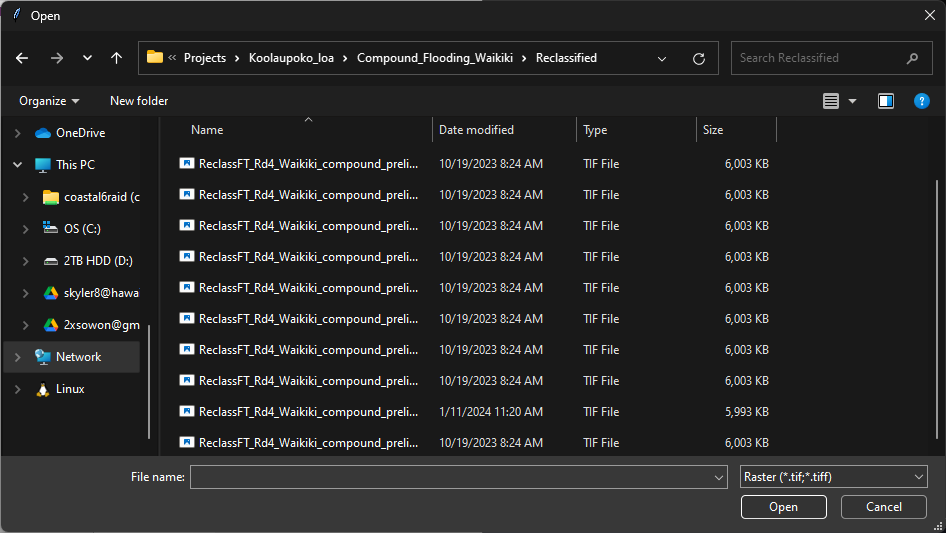
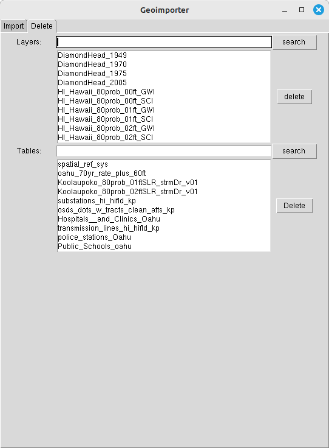
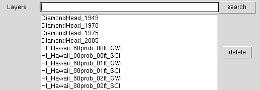
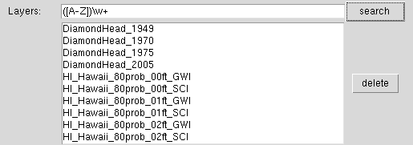

# Geoserver Layer Managment

There are only two ways to interface with the Geoserver Layer management:  
1. Geoimporter (easiest and recommened way)
2. Geoserver Interface (Not Recommeneded)

## Geoserver & PostgresDB Management via Geoimporter

[Github Repository](https://github.com/ryvami/geoimporter)

### Adding & Publishing Layers to Geoserver

Most of the fields will be filled in because there is a .env file provided with the executable file. If the fields are not filled in, then the .env file is missing, but it should not be hard to enter the information in.

1. Change the URL to the desired Geoserver
2. Enter username
3. Enter password
4. Enter the workspace that you would like to publish your layer to
5. Click "Dir" button to open directory dialog

7. In the directory dialog, select all of the layers that you would like to upload
6. Click "Import" to upload & publish the selected layers to your Geoserver

There will be a output console in the background to show confirmations that the layer has been uploaded, and if there are any error, the program will dump the error in the console.

### Deleting Layer from Geoserver

Layers in Geoserver: 

Shapefile table in PostgresDB: 

Note: Deleteing the table in the postgres will unpublish the layer on the Geoserver

The text input box uses regex pattern matching, so you can type in a regex patter to search for the layer that you would like to delete.

You do not need to use regex pattern, but you can just type in a search term and all of the names that contain the search term will appear.

1. After searching for the layer/table, click on all of the layers that you would like to delete
2. Click the "Delete" button to execute 

The output in the console box will reflect whether the layer/table has been successfully deleted.