# WMS URLs For CRC Geoservers
 - https://crcgeo.soest.hawaii.edu/geoserver/ows?version=1.3.0 (SLR Viewer Layers)
 - http://crc-geoserver2.soest.hawaii.edu:8600/geoserver/ows?version=1.3.0 (Historical Mosaics)

# Adding WMS Connection to QGIS

1. Right click "WMS/WMTS" option in Browser Panel
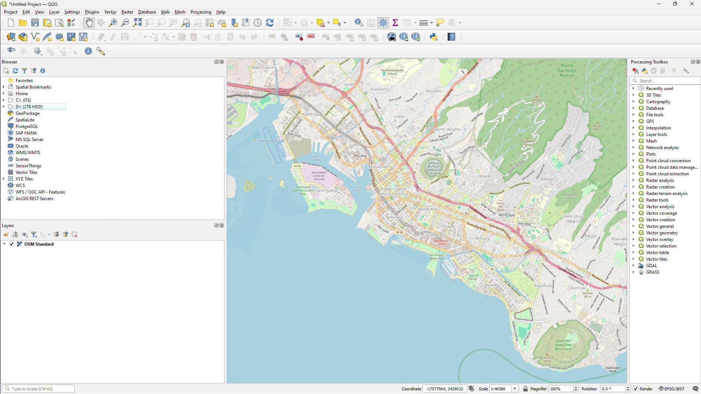
2. Select "New Connection..." in the right-click menu
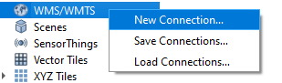
 - The "Create a New WMS/WMTS Connection" Dialog will pop up
3. Enter a name in the "Name" field (Ex. crcgeo)
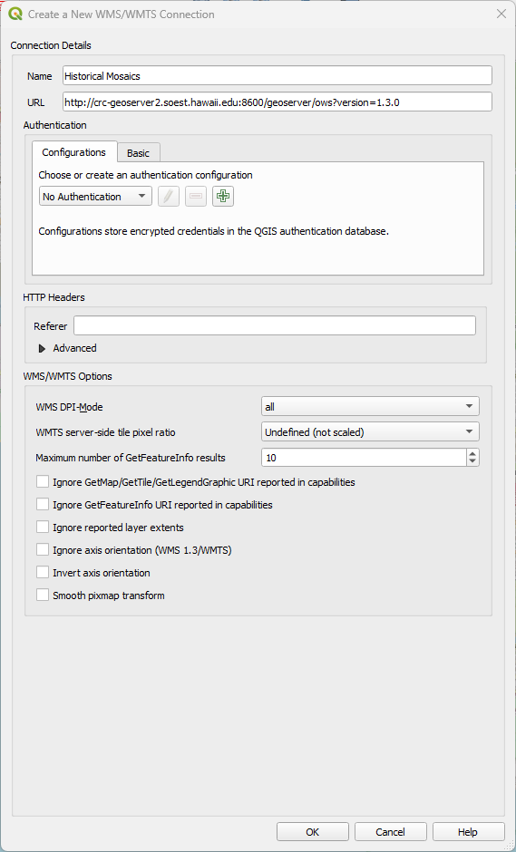
4. Enter the WMS Server URL in the "URL" field
5. Click "OK"

6. If the connection is successful, layers served by the Geoserver will appear under the name of the connection
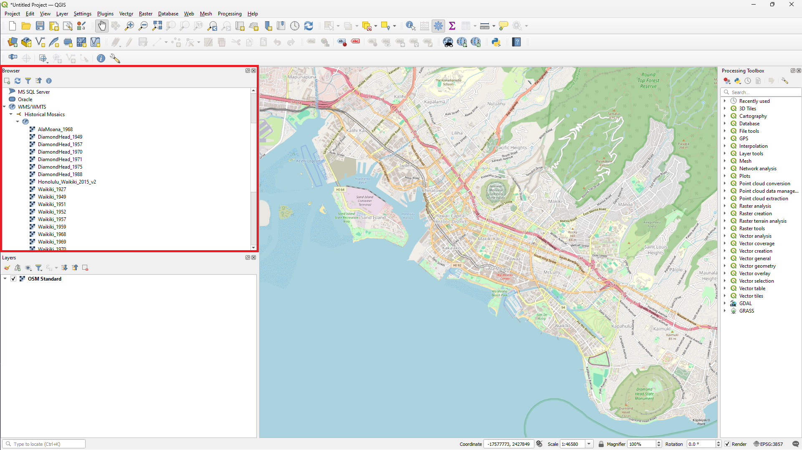

7. If the connection fails, you will encounter "Download of capabilities failed: ..."
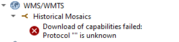

8. Double click any layer under your desired server and it should appear on the map 
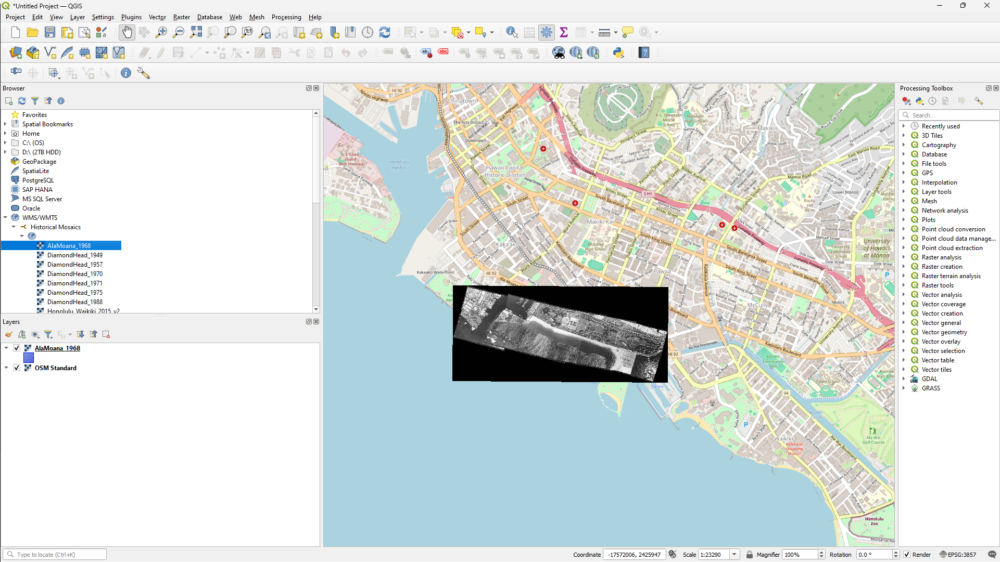

# Adding WMS Connection to ArcMap Desktop

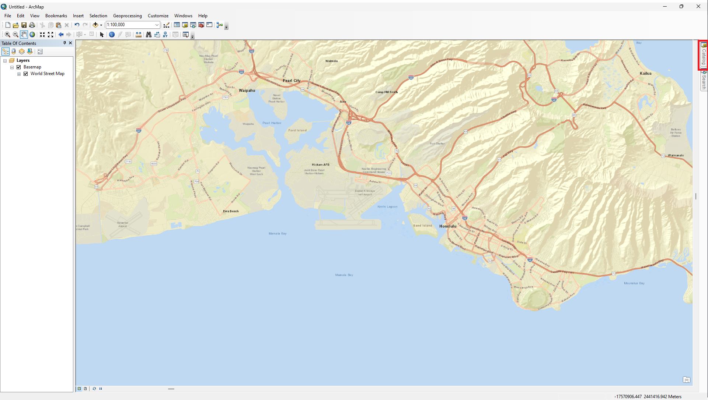

1. Click the "Catalog" button on the top right of ArcMap 
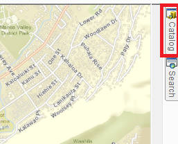

2. In the "Catalog" pane, click add WMS Server
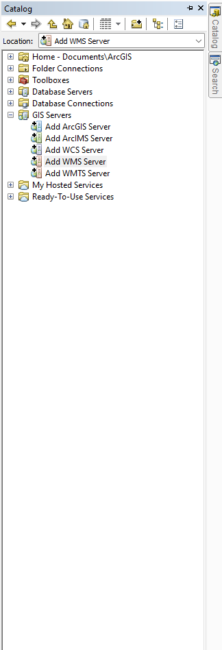

2. Enter the desired WMS Server URL in "URL" input box

3. Test the connection by clicking "Get Layers" button
    - If connection is good, layers in geoserver will appear in "Server Layers" box
4. Click "Ok" button
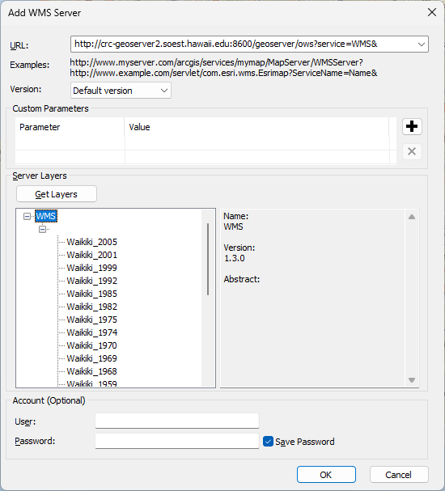

5. In the "Catalog" pane, expand the WMS server option that you just added until the list of layers show up
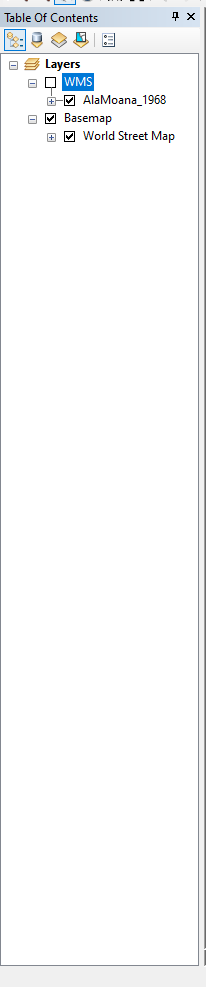

6. Drag and drop layer in "Table of Contents" for it to appear on the map
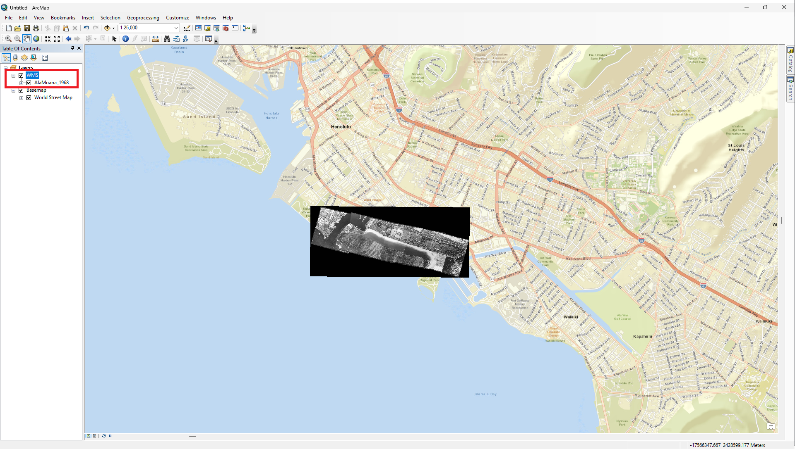
