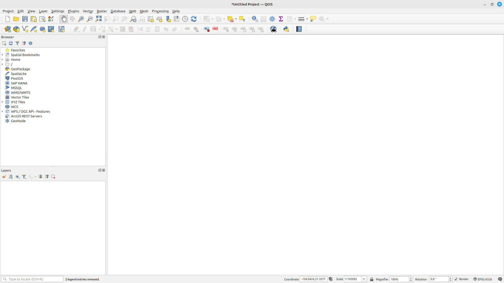
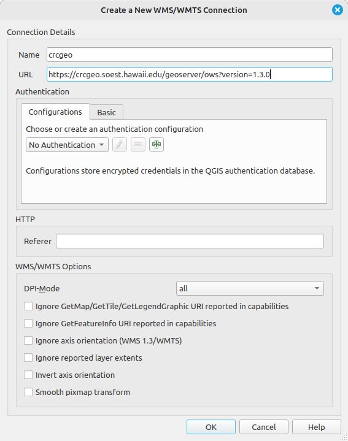
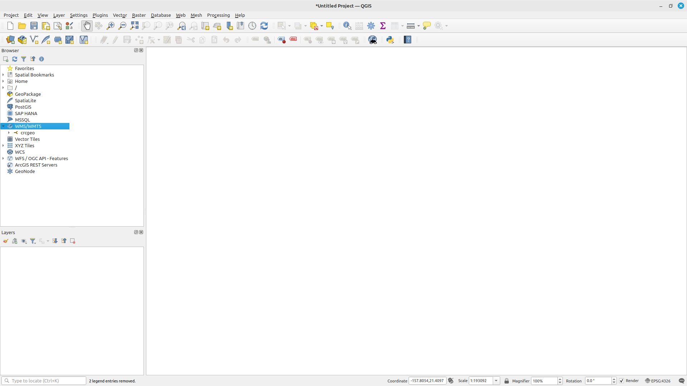
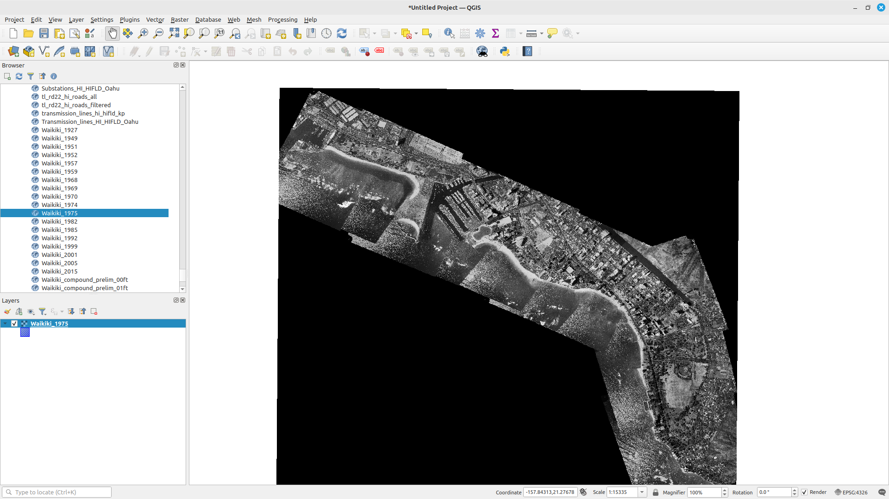
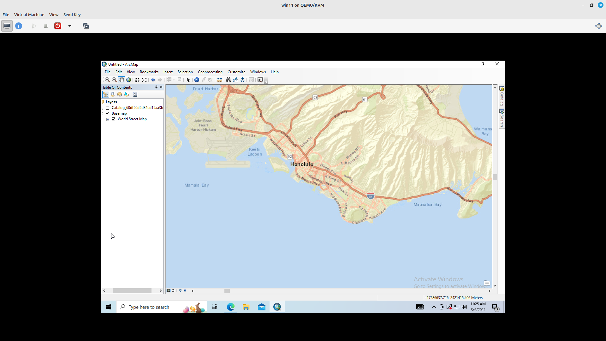
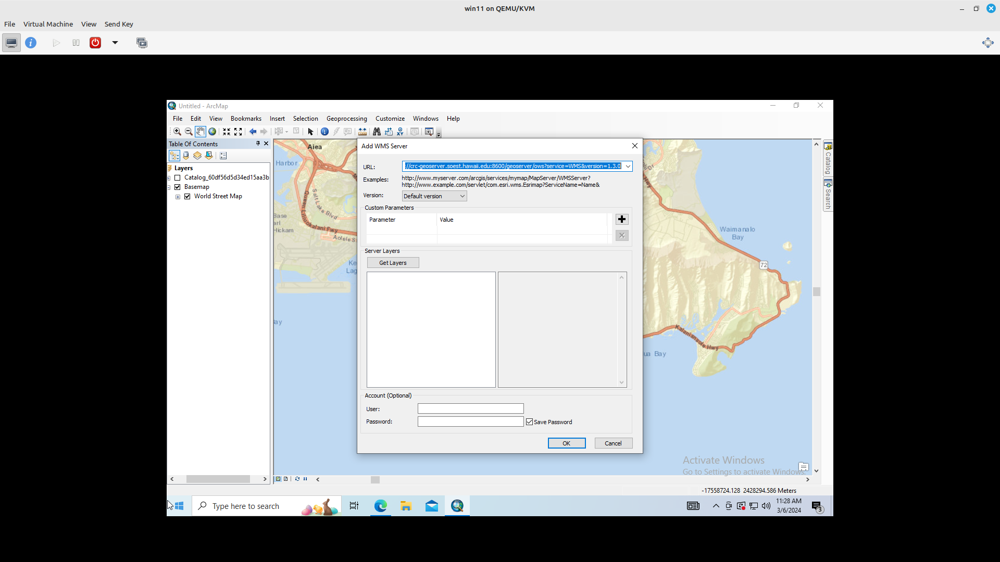
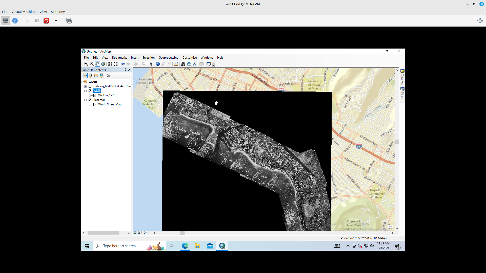

# Adding WMS Connection to QGIS

1. Right click "WMS/WMTS" option in Browser Panel
2. Select "New Connection..." in menu

3. Enter a name for WMS connection (Ex. crcgeo)
4. Enter "https://crcgeo.soest.hawaii.edu/geoserver/ows?version=1.3.0" as the URL for WMS connection
5. Click "Ok"

6. Layers served by the Geoserver will appear under the name of the connection
7. Double click any layer to add it to the map

# Adding WMS Connection to ArcMap Desktop

1. In "Catalog" pane, click add WMS Server
2. Enter "https://crcgeo.soest.hawaii.edu/geoserver/ows?version=1.3.0" in URL input box

3. Test the connection by clicking "Get Layers" button
    - If connection is good, layers in geoserver will appear in "Server Layers" box
4. Click "Ok" button

5. In "Catalog" pane, expand the WMS server option that you just added until the list of layers show up
6. Drag and drop layer in "Table of Contents" for it to appear on the map
