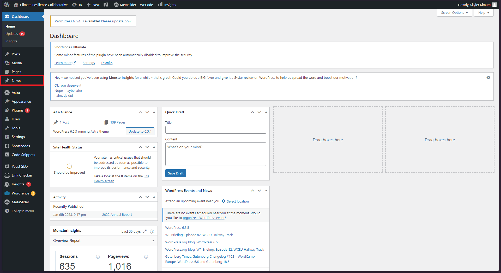
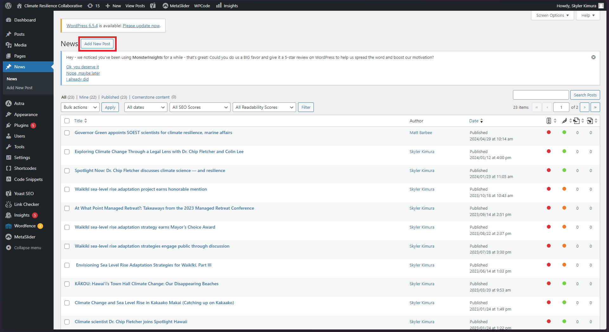
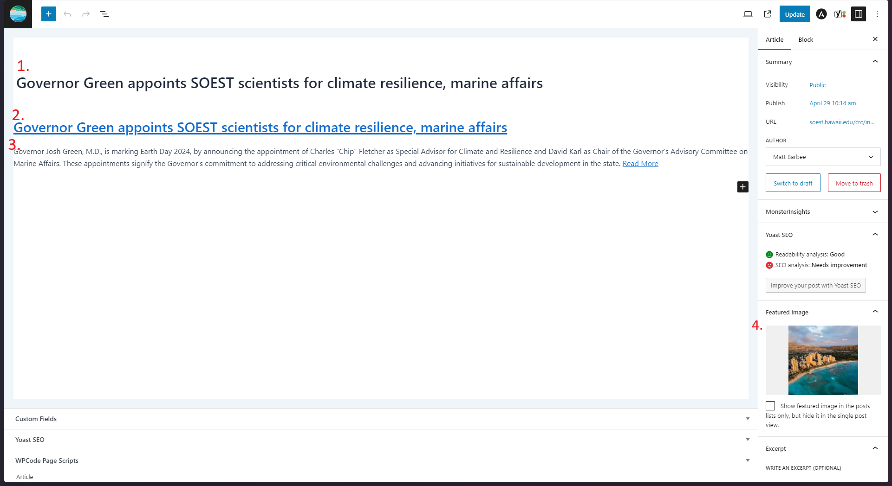
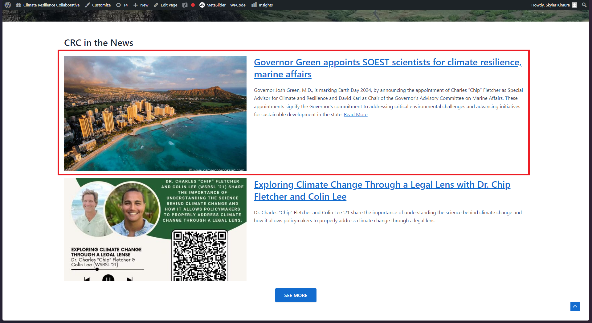
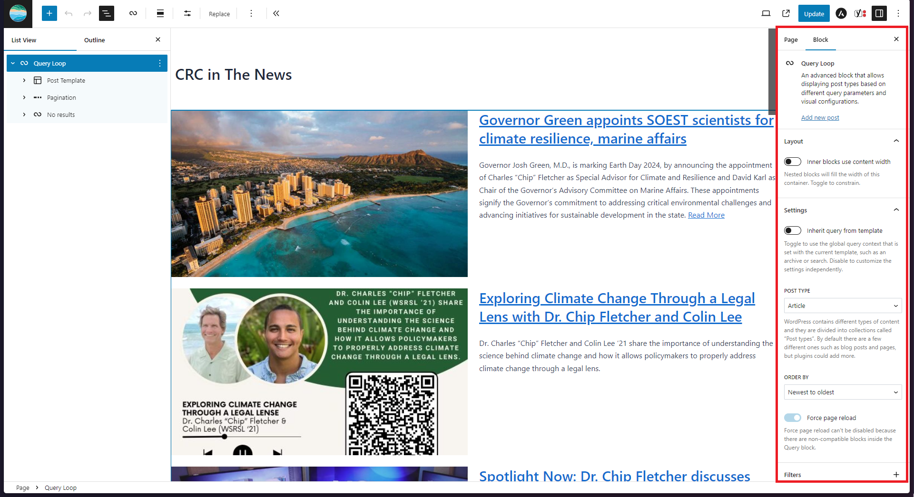
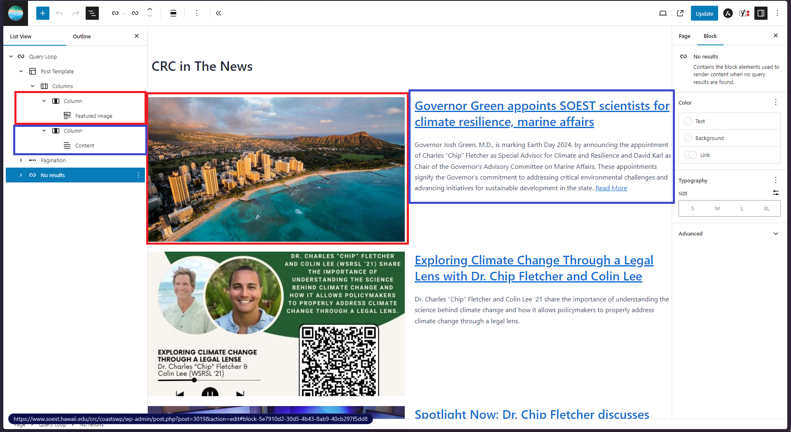

# News Articles
News articles are a custom wordpress post type created by Skyler (skyler8@hawaii.edu) that are displayed on the website via query loop.
If you would like to learn more about custom wordpress post types and create addition post types, you can check 
out the [Wordpress Documentation](https://developer.wordpress.org/plugins/post-types/registering-custom-post-types/)

## How to Create News Article
### Wordpress Admin Dashboard

To view the News article post type, click on "News" on the left menu on the Admin Dashboard (Shown in Red box).

### Adding New Post

The page will show all of the previous news articles that have been created. Click on "Add New Post".

### Formatting Post

Follow the above guideline shown in the figure above carefully. 
1. Set the Title of the Post to be the title of the article. This title will not be shown on the page because post titles cannot have links in them on wordpress.
2. Enter an Level 2 Heading (H2) with the title of the article as the first element in the content
3. Enter an excerpt or summary of the news article (usually the first paragraph of news article) followed by "Read More" with a link to the article

### Post Created

If all things went well, you would have created a news article post type that will be displayed on the CRC Home Page and CRC in the News page

## Query Loop in Wordpress
### Settings

When you edit the "CRC in the News" page, you will see that the only content is a "Query Loop" on the Content outline. 
You can click on Query Loop and find the settings for the Query Loop behaviors. If you can learn more about Query Loop on
the [Wordpress Documentation](https://wordpress.com/support/wordpress-editor/blocks/query-loop-block/).

### Template

The Query Loop is looking for all the Posts within a Post Type and displaying it as a template for better organization
of the Post Content. You can see this if you expand the Post Template and find how I organized the New Article Content.
1. In red, the featured image of the article is shown in the first (left) column
2. In blue, the excerpt of the article is shown in the second (right) column

Feel free if needed to update the template or change certain things about the template like size of columns.
