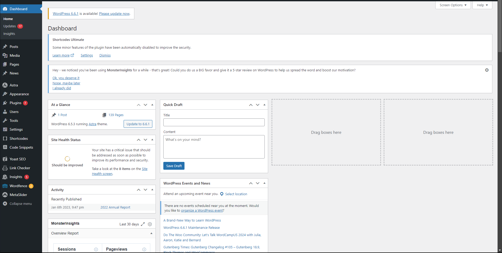
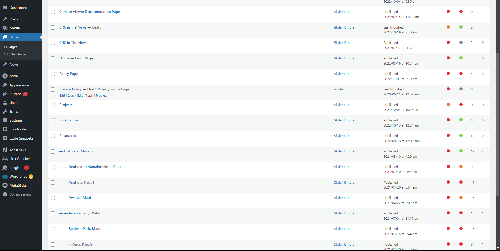
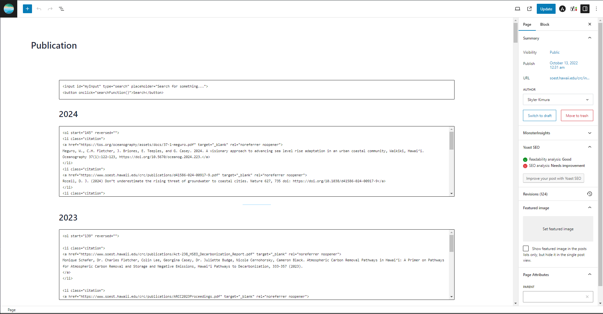
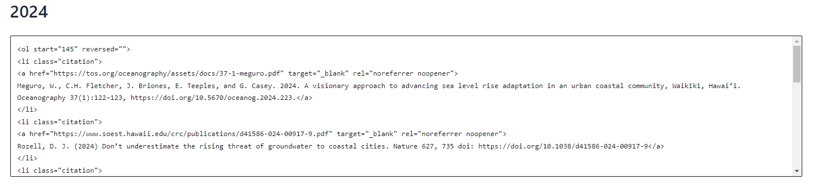
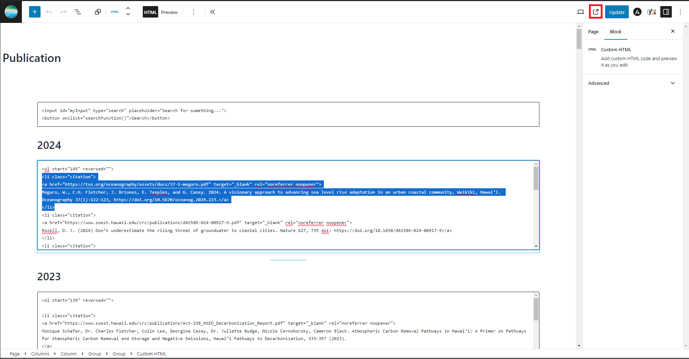
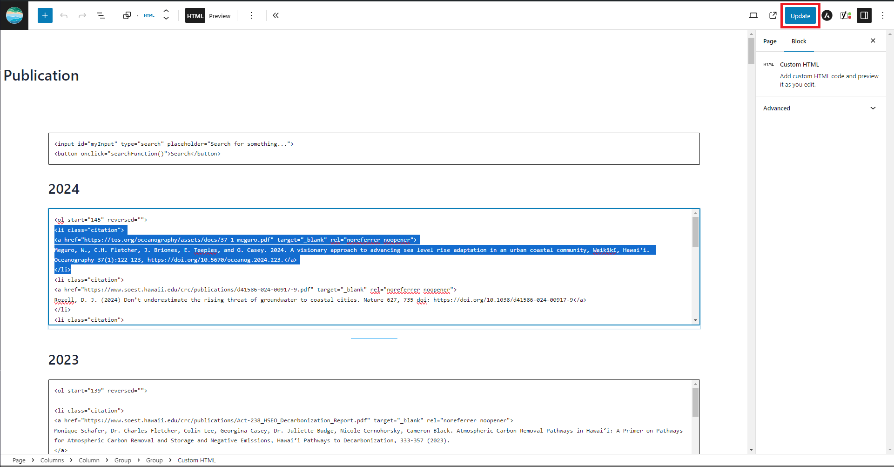

1. On Wordpress admin panel, navigate to the "Pages" dashboard on the left navbar

2. On the "Pages" dashboard, select "Publication"

Each publication will be under the publish year.

3. In the respective textbox, add the publication citation within the ordered list HTML tag

4. Nest the citation within an anchor tag and the outer most a list tag with the class attribute "citation"
Below is an example:
```
<ol start="###" reversed="">
<li class="citation">
<a href="https://tos.org/oceanography/assets/docs/37-1-meguro.pdf" target="_blank" rel="noreferrer noopener">
Meguro, W., C.H. Fletcher, J. Briones, E. Teeples, and G. Casey. 2024. A visionary approach to advancing sea level rise adaptation in an urban coastal community, Waikīkī, Hawai‘i. Oceanography 37(1):122–123, https://doi.org/10.5670/oceanog.2024.223.</a>
</li>
```
5. If you would like to preview your changes click "View Page" button

6. After your changes have been made, click "Update"

